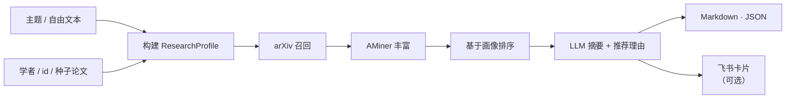

<div align="center">

# 📚 aminer-rec

**别再在海量 arXiv 里溺水了，去读那些对你真正重要的论文。**

一个个性化论文推荐引擎：把一句关于研究方向的描述，变成一份带摘要和推荐理由的论文清单 —— 基于 AMiner + arXiv + 大模型构建。


</div>

---

## ✨ 你会喜欢它的理由

想象这样一个周一早晨：你坐下来，敲下

> *"我做多模态智能体和 tool use"*

一分钟后，你就拿到了一份**排好序的近期论文清单**，每篇都附带**通俗摘要**和**一句话推荐理由**。再也不用开 200 个 arXiv 标签页，再也不用担心「我是不是错过那篇重要的」。

`aminer-rec` 替你跑完整个闭环：

| 你给它 | 它还你 |
|---|---|
| 一句话 / 一个主题列表 / **或** 学者名 | 一份聚焦、相关的近期论文清单 |
| 你的 AMiner 学者 id / 种子论文 | *基于画像* 的排序，更贴合你的口味 |
| `--language-sort en` / `--start-year 2024` | 按语言、年份筛选 |

## 🎯 两种冷启动，同一条流水线

哪种更省事就用哪种：

- 🧠 **主题启动** —— 用大白话描述你做什么就行。
  > `--free-text "我做多模态智能体和 tool use"`
- 🎓 **学者启动** —— 从 `aminer_user_id`、姓名+机构，或几篇代表论文出发。流水线会从你的真实发文历史构建 `ResearchProfile`，并据此排序。

两条路径最终都归并成一个 `ResearchProfile`，再走同一条流水线：



## 👀 输出长什么样

跑一次，`outputs_cli/recommendation.md` 就是一份清爽可读的论文清单 —— 每篇都带摘要和「为什么挑这篇给你」的一句话理由。单条推荐长这样：

```markdown
为你推荐 5 篇相关论文（研究方向：多模态智能体 / tool use）

---

**1. [ToolGen：统一的工具检索与生成框架...](https://www.aminer.cn/pub/5f...)**

年份：2024 | 关键词：LLM · tool use · agents

作者：X. Y. Zhang、A. B. Li、C. Wang et al.

推荐理由：与你的「tool use」方向高度吻合，提出统一工具检索与生成的框架，正好补你最近关注的能力缺口。

本文提出 ToolGen，将工具的检索与调用统一进一个生成式框架……（摘要正文）
```

配套的 `recommendation_result.json` 则是完整结构化结果 —— 包含 `title`、`keywords`、`authors`、`famous_authors`、`summary`、`recommendation_reason`、`aminer_paper_url` 等字段，方便你接到下游任何系统里。

## 🚀 快速开始

### 1 · 安装

```bash
python3 -m venv .venv
source .venv/bin/activate          # Windows: .venv\Scripts\activate
python3 -m pip install --upgrade pip
pip install -e .
```

### 2 · 配置

```bash
cp config.example.yaml config.yaml
```

在 `config.yaml` 里填好这三处：

```yaml
aminer:
  token: "<你的 AMiner token>"
llm:
  api_key:  "<你的 OpenAI 兼容 key>"
  base_url: "<你的模型服务地址>"
  model:    "gpt-5-mini"
```

> 💡 `datacenter.segmentation_url` 是可选项 —— 留空即可，链路会退化到更轻量的本地解析。

### 3 · 拿推荐

```bash
aminer-rec recommend \
  --config config.yaml \
  --topics "多模态智能体, tool use" \
  --start-year 2024
```

结果写在 `outputs_cli/`：

- `recommendation.md` —— 带摘要的可读清单
- `recommendation_result.json` —— 完整结构化结果
- 外加中间产物（`user_profile.json`、`papers_ranked.json`、`papers_summarized.json`）

## 🧪 更多示例

一句话描述自己：

```bash
aminer-rec recommend \
  --free-text "我做多模态智能体和 tool use，帮我推荐最近论文" \
  --output-markdown outputs/mine.md \
  --output-json outputs/mine.json
```

2024 年以来关于 LLM reasoning 的英文论文：

```bash
aminer-rec recommend --topics "LLM reasoning" --language-sort en --start-year 2024
```

从学者 + 其代表作冷启动：

```bash
aminer-rec recommend \
  --scholar-name "Jie Tang" --scholar-org "Tsinghua University" \
  --paper-title "OAG-Bench" --paper-title "RPC-Bench"
```

也可以用仓库内脚本入口：

```bash
python3 scripts/recommend.py --config config.yaml --topics "多模态智能体, tool use"
```

## 🐦 飞书 / OpenClaw 模式（可选）

把仓库复制到你的 skills 目录：

```bash
cp -R ./aminer-rec ~/.openclaw/skills/aminer-rec5
```

然后在飞书里：

```text
/aminer-rec5 topics: 多模态智能体, tool use
/aminer-rec5 topics: LLM reasoning  language_sort: en  start_year: 2024
/aminer-rec5 scholar: Jie Tang  org: Tsinghua University  papers: OAG-Bench | RPC-Bench
/aminer-rec5 aminer_user_id: 696259801cb939bc391d3a37  topics: 多模态, tool use
```

OpenClaw 里的命令名仍是 `/aminer-rec5`。

## ✅ 开箱即用的能力

- 💬 **自然语言优先** —— 一句话就够
- 🔍 **arXiv + AMiner 丰富** —— 召回更广，元数据更深
- 👤 **学者感知的冷启动** —— 基于你真实画像的排序
- 📝 **结构化摘要** —— 每篇都有通俗摘要 *和* 推荐理由
- 📄 **CLI 输出** —— Markdown / JSON，方便版本管理
- 🐧 **优雅降级** —— 缺了可选组件也不会跑不起来
- 🚦 **输入护栏** —— 合理限制，保证跑出来可复现

## 📂 仓库结构

| 路径 | 用途 |
|---|---|
| `SKILL.md` / `SKILL_zh.md` | OpenClaw skill 契约 |
| `pyproject.toml` | 安装元数据 + `aminer-rec` 命令 |
| `aminer_rec/` | 包级 CLI 分发入口 |
| `scripts/recommend.py` | 独立 CLI 入口 |
| `scripts/handle_trigger.py` | 飞书 / OpenClaw 触发入口 |
| `scripts/` | 核心流水线：解析、画像、召回、摘要、渲染、派发 |
| `config.example.yaml` | 安全版示例配置 |

## 🛠️ 接口约束与护栏

对外入口：

```bash
aminer-rec recommend --base-dir . --topics "多模态智能体, tool use"
python3 scripts/recommend.py      --base-dir . --topics "多模态智能体, tool use"
python3 scripts/handle_trigger.py --base-dir . --text "<message>"
```

- `aminer_user_id` —— 24 位十六进制字符串
- `topics` —— 最多 8 个，每个 ≤ 80 字符
- `paper_titles` —— 最多 8 个，每个 ≤ 300 字符
- `scholar_name` ≤ 80 字符 · `scholar_org` ≤ 160 字符 · `free_text` ≤ 600 字符
- `papers_file` —— 只接受 `.json`，且必须在 skill 目录内
- `language_sort` —— `zh` 或 `en`
- `start_year` / `end_year` —— 1900–2100 之间的整数

派发前路由字段会截断到安全长度。

## 🔌 可选内部扩展点

这些都没配？照样能跑，部分功能会优雅降级而已。

- `DATACENTER_SEGMENTATION_URL` —— 更好的分词 / 参数抽取
- `RECSYS_NEXT_DIR` —— 内部 UID 画像查询
- `OPENCLAW_HOME` / `OPENCLAW_CONFIG_PATH` / `OPENCLAW_SESSIONS_PATH` —— 覆盖本地 OpenClaw 路径

## 📄 License

[MIT](LICENSE) —— 读论文，发想法，注明出处即可。
